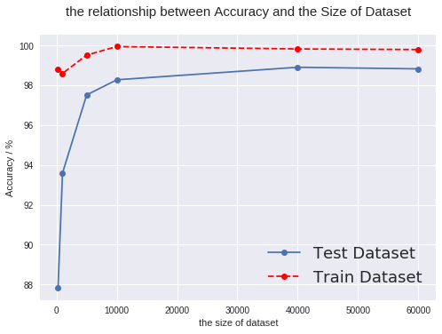
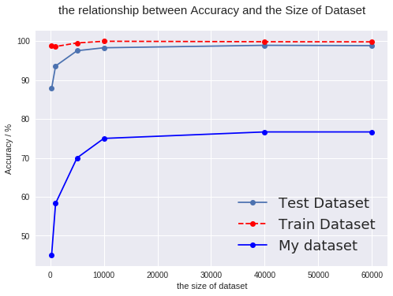

# <center> Lab 8 Convolutional Neural Networks  </center>
## <center> Yanling Wu </center>
## <center> yw996 </center>

## 1. Pytorch Learning Curves
Int this section, we explore the effect of the training dataset size on system performance. At first, we used 250 data samples to acquire the general understanding of different hyperparameters. 
### (1) Explore the impact of hyperparameters 
Firstly, I changed the values of different hyperparameters and only changed one parameter at a time. The results are shown as below: 

The num-samples is 250:
- iteration_times is 3:
    - batch_size is 50, the accuracy is 64%. 
    - batch_size is 25, the accuracy is 87%. 
    - batch_size is 10, the accuracy is 90%. 
- iteration_times is 5:
    - batch_size is 50, the accuracy is 66%. 
    - batch_size is 25, the accuracy is 92%. 
    - batch_size is 10, the accuracy is 90%. 
- iteration_times is 10:
    - batch_size is 50, the accuracy is 92%. 
    - batch_size is 25, the accuracy is 100%. 
    - batch_size is 10, the accuracy is 90%. 
- iteration_times is 10 && batch_size is 25:
    - learn_rate is 0.01, the accuracy is 96%. 
    - learn_rate is 0.001, the accuracy is 100%.
    - learn_rate is 0.0001, the accuracy is 76%.

All in all, from above results, we can see something important. 
- The times of iteration will improve the performance of the model because the times of iteration represents the times of training model and this times is biggers it will be better of performance, only if the model has not converged yet. 
- Batch_size is also a significant parameter that can change the performance of system hugely. If batch_size is big, it will taks more time to get a better accuracy of model. Hence, we need to consider suitable batch size and the times of iteration. 
- The learn rate can affect the accuracy of model significantly and for our model, the most fitting value of it is 0.001 within 10 times iteration. 


### (2) Different sizes of training dataset
I chose six differetnt sizes of training dataset which are 250,1000, 5000, 10000, 40000, 60000. The hyperparameters are listed following: 
  -  **batch size:**  only for 250 data samples batch size is 50, and for others batch size is 100. 
  - **iteration_times**  which is num_epochs  = 8.
  - **learning_rates** = 0.001  . 
  - **num_classes = 10** which should not be changed. 

Based on above hyperparameters, I trained the model, do prediction and get the accuracy of them. Following the lab instruction, plot two times at a image to show the change trend of accuracy as the change of the size od dataset. The figure shows below: 

<center>
  

Figure 1. The Accuracy of the traning dataset and the test dataset
</center>


### (3) Discussion

There are something interesting we can know from this part. 

- The peredicted accuracy of the training dataset is always higher than that of test dataset, which is actually intuitive. Because this model is trained by training dataset which means it is easier for this model to predict correctly compared to test dataset which the model have not seen before. 


- In general, the size of train dataset is bigger, the accuracy of prediction is higher since the big size of training dataset can guarantee that there are more examples for model to extract the features of images. 


- When size of dataset is small, if it increased, the accuracy will be improved very hugely, like the change of size of train dataset from 250 to 10,000. However, when the accuracy has already been more than 96%, if we want to improve the system performance, we need a number of samples. For instance, when the size of training dataset changed from 10,000 to 60,000, the accuracy only changed from 98.28% to 98.93%. 


## 2. Pytorch system evaluation 

### (1) Select the worst and best case

In this part, we will select the best and worst sizes of train dataset to train the model and test the dataset that we created by ourselves in last lab 7. 


The size of train dataset with the worst performance is 250 data samples with 25 batch size and the size of train dataset with the best performance is 60,000 data samples with 100 batch size. The worst and best cases of result in the part 1 shows below. 

|  | size of train dataset| Test Dataset Accuracy (%)|Batch size|
| --- | --- | --- |--- |
| The worst case| 250 | 88.01| 25|
| The best case | 60,000| 99.86| 100|

### (2) Result 
Use these two case to train the model and test the personal dataset and the train dataset. The result shows following: 

|  | size of train dataset| Train Dataset Accuracy (%)|Created Dataset's Accuracy (%)|
| --- | --- | --- |--- |
| The worst case| 250 | 88.01| 53.33|
| The best case | 60,000| 99.86| 76.66|

Also, I trained the all train dataset that I chose in part 1 and used them to predict the personally created dataset. Plot the accuracy change curve below: 

<center>
    

Figure 2. The Accuracy of the traning dataset, the test dataset and personally created dataset
</center>


### (3) Discussion

- Firstly, we can see the accuracy of the personally created dataset'accuracy is far lower than that of either train dataset or test dataset. This is because while we created dataset, we also create ten images that are totally unrelated to the ten digits. These the prediction of ten images will be definitely wrong, which lower down the predicted accuracy. 


- Secondly, there is one interesting thing that the accuracy change tendency of personally created dataset along with size of train dataset is similar to that of test dataset of MNIST. When the size od train dataset is small, the accuracy can be improved hugely. 

#### Note that I combine the code of part 1 and part2. 


## 3. Keras model design 

### (1) Show confusion matrix

Run the code in the tutorial and it will take some time to run. Calculate the confusion matrix. In order to visualize data, plot the confusion matrix as "heat map". It shows below: 

<center>
   

Figure 3. confusion matrix for the result of the model in the tutorial
</center>


### (2) Compare the performance between using batch normalization and image standardization 
- Batch normalization is used to normalize the input layer by adjusting and scaling the activations. 
- Image standardization is used to normalize the images so that they have a mean 0.0 and a standard deviation of 1.0. 

Follow the lab instruction, modify the configuration of model to train it and the following table shows the results. We can see the batch normalization can help to improve the performance since the accuracy increased after adding the batch normalization. Besides, the image standardization can help to accelerate the speed of loss decreasing because after the first epoch, the validation accuracy increased from0.9806 to  0.9842. 


| What change | Accuracy | loos |
| --- | --- |
| origin, nothing to change | 0.991| 0.0265766 |
| only add batchNormalization in all layers | 0.9917 | 0.0276597|
| Only add standardization |0.9910|0.0292199 |
| Add batchNormalization && Standardization | 0.9909|0.0291459|


### （3） Add a new convolution layer
Adding a new convolution layer can help to increase the accuracy of predicting. The below table shows the accuracy comparison. 


| What change | Accuracy | loos |
| --- | --- |
| origin, nothing to change | 0.991| 0.0265766 |
| Add one more convolutional layer | 0.9932 | 0.02184936 |

###  (4) Try to get the best result

In order to improve the performance of the system, I tried to modeify different hyperparameters and I used 200 epoches to train the model which takes a lot of time to run. The result shows below: 


| | What change | Accuracy | loos |
| --- | --- | --- | --- |
| 1 | 3 convolutional layer & batchNormalization & batchsize = 64| 0.9944 | 0.05109033 |
| 2 | 4 convolutional layer & batchNormalization & batchsize = 32| 0.9947 | 0.04382792 |
| 3 | 4 convolutional layer & batchNormalization & batchsize = 64| 0.9961 | 0.04383031 |
| 4 | 5 convolutional layer & batchNormalization & batchsize = 64| 0.9946 | 0.04442658 |
| 5 | 3 convolutional layer & batchNormalization & batchsize = 128| 0.9943 | 0.0415949 |
| 6 | 3 dense layers & batchNormalization & batchsize = 64| 0.9943 | 0.06143|


We can see the best accuracy I got is 99.61%. It increases from 99.15% to 99.61%. 
And the hyperparameters are shown the following table. 

|parameter name | value |
| --- |--- |
| batch size | 64 |
| the number of epoch | 200|
| the number of convolutional layers| 4|
| the number of dense layers | 2|
| BatchNormalization | used|
| Standardization | used|


The following figure shows the confusion matrix. Compared with the original one, there is less wrong prediction. 

<center>
    

Figure 4. confusion matrix for the best result
</center>


### （5) Discussion 

Some parameters can have a huge influence on the performanc of the keras model. 
- First of all, the number of layers in the model and what is the layer are very significant for model. From my modification about the model, I know that it is not good that there are too many number of layers. When the layers no matter the convolutional layers or dense layers are too many, the performancy of the system will get worse. Hence, I chose 4 convolutional layers and 2 dense layers to get the best result. 


- In addition, batch size can affect the performance too. I tried to change the batch size to 32, 64, 128. The best result are generated by batch size of 64. It means it is not true that the smaller batch sizes are better. 


- The number of epoch is important. In general, the bigger epoch will have better result. But if the model is good, the limited epoch can get the good performance. 

## 4. Code Appendix

### (1) Pytorch code
#### Grant Google Colab to read the data from my Google Drive


```python
# Grant Google Colab to read the data from my Google Drive
!apt-get install -y -qq software-properties-common python-software-properties module-init-tools
!add-apt-repository -y ppa:alessandro-strada/ppa 2>&1 > /dev/null

!apt-get update -qq 2>&1 > /dev/null
!apt-get -y install -qq google-drive-ocamlfuse fuse
from google.colab import auth
auth.authenticate_user()
from oauth2client.client import GoogleCredentials
creds = GoogleCredentials.get_application_default()
import getpass
!google-drive-ocamlfuse -headless -id={creds.client_id} -secret={creds.client_secret} < /dev/null 2>&1 | grep URL
vcode = getpass.getpass()
!echo {vcode} | google-drive-ocamlfuse -headless -id={creds.client_id} -secret={creds.client_secret}
#Assign the name of root directionary of Google Drive 
!mkdir -p drive
!google-drive-ocamlfuse drive
import os
os.chdir("drive/Acoustic_Localization/keras") 
# show the file in directionary
!ls
```

    E: Package 'python-software-properties' has no installation candidate
    Selecting previously unselected package libfuse2:amd64.
    (Reading database ... 22298 files and directories currently installed.)
    Preparing to unpack .../libfuse2_2.9.7-1ubuntu1_amd64.deb ...
    Unpacking libfuse2:amd64 (2.9.7-1ubuntu1) ...
    Selecting previously unselected package fuse.
    Preparing to unpack .../fuse_2.9.7-1ubuntu1_amd64.deb ...
    Unpacking fuse (2.9.7-1ubuntu1) ...
    Selecting previously unselected package google-drive-ocamlfuse.
    Preparing to unpack .../google-drive-ocamlfuse_0.7.1-0ubuntu2~ubuntu18.04.1_amd64.deb ...
    Unpacking google-drive-ocamlfuse (0.7.1-0ubuntu2~ubuntu18.04.1) ...
    Setting up libfuse2:amd64 (2.9.7-1ubuntu1) ...
    Processing triggers for libc-bin (2.27-3ubuntu1) ...
    Setting up fuse (2.9.7-1ubuntu1) ...
    Setting up google-drive-ocamlfuse (0.7.1-0ubuntu2~ubuntu18.04.1) ...
    Please, open the following URL in a web browser: https://accounts.google.com/o/oauth2/auth?client_id=32555940559.apps.googleusercontent.com&redirect_uri=urn%3Aietf%3Awg%3Aoauth%3A2.0%3Aoob&scope=https%3A%2F%2Fwww.googleapis.com%2Fauth%2Fdrive&response_type=code&access_type=offline&approval_prompt=force
    ··········
    Please, open the following URL in a web browser: https://accounts.google.com/o/oauth2/auth?client_id=32555940559.apps.googleusercontent.com&redirect_uri=urn%3Aietf%3Awg%3Aoauth%3A2.0%3Aoob&scope=https%3A%2F%2Fwww.googleapis.com%2Fauth%2Fdrive&response_type=code&access_type=offline&approval_prompt=force
    Please enter the verification code: Access token retrieved correctly.


#### Install the libraried that we need in Google Drive


```python
#install torch in google colab
# http://pytorch.org/
from os.path import exists
from wheel.pep425tags import get_abbr_impl, get_impl_ver, get_abi_tag
platform = '{}{}-{}'.format(get_abbr_impl(), get_impl_ver(), get_abi_tag())
cuda_output = !ldconfig -p|grep cudart.so|sed -e 's/.*\.\([0-9]*\)\.\([0-9]*\)$/cu\1\2/'
accelerator = cuda_output[0] if exists('/dev/nvidia0') else 'cpu'
!pip install -q http://download.pytorch.org/whl/{accelerator}/torch-0.4.1-{platform}-linux_x86_64.whl torchvision

!pip install Pillow==4.0.0
!pip install PIL
!pip install Image
```


```python
#import important libraries
import PIL.Image
import torch 
import torch.nn as nn
import torchvision
import torchvision.transforms as transforms
import numpy as np
import matplotlib.pyplot as plt
from torch.utils.data.sampler import *
```

    Requirement already satisfied: Pillow==4.0.0 in /usr/local/lib/python3.6/dist-packages (4.0.0)
    Requirement already satisfied: olefile in /usr/local/lib/python3.6/dist-packages (from Pillow==4.0.0) (0.46)
    Collecting PIL
      Could not find a version that satisfies the requirement PIL (from versions: )
    No matching distribution found for PIL
    Requirement already satisfied: Image in /usr/local/lib/python3.6/dist-packages (1.5.27)
    Requirement already satisfied: django in /usr/local/lib/python3.6/dist-packages (from Image) (2.1.3)
    Requirement already satisfied: pillow in /usr/local/lib/python3.6/dist-packages (from Image) (4.0.0)
    Requirement already satisfied: pytz in /usr/local/lib/python3.6/dist-packages (from django->Image) (2018.7)
    Requirement already satisfied: olefile in /usr/local/lib/python3.6/dist-packages (from pillow->Image) (0.46)


#### Define the function to custom loader the data from local file


```python
""" Custom datatset loader
    based on https://github.com/utkuozbulak/pytorch-custom-dataset-examples
"""
    
import pandas as pd
from torch.utils.data.dataset import Dataset
from torchvision import transforms
from PIL import Image

class SimpleDataset(Dataset):
    def __init__(self, data_path, csv_name, transform = None ):
        """
        Args:
            data_path (string): path to the folder where images and csv files are located
            csv_name (string): name of the csv lablel file
            transform: pytorch transforms for transforms and tensor conversion
        """
        # Set path
        self.data_path = data_path
        # Transforms
        self.transform = transform
        # Read the csv file
        self.data_info = pd.read_csv(data_path + csv_name, header=None)
        # First column contains the image paths
        self.image_arr = np.asarray(self.data_info.iloc[:, 0])
        # Second column is the labels
        self.label_arr = np.asarray(self.data_info.iloc[:, 1])
        # Calculate len
        self.data_len = len(self.data_info.index)
        

    def __getitem__(self, index):
        # Get image name from the pandas df
        single_image_name = self.image_arr[index]
        # Open image
        img_as_img = Image.open(self.data_path + single_image_name)
        if self.transform is not None:
              img_as_img = self.transform(img_as_img)

        # Get label(class) of the image based on the cropped pandas column
        single_image_label = self.label_arr[index]
        #convert to tensor to be consistent with MNIST dataset
        single_image_label = torch.LongTensor( [ single_image_label ] )[0]
        return (img_as_img, single_image_label)

    def __len__(self):
        return self.data_len

```

#### Read the personally created dataset from Google Drive and show some images of them


```python
from matplotlib.pyplot import imshow
mydataT = SimpleDataset( "./idata/", "label.csv", transform=transforms.ToTensor())
testc = mydataT[0]
testT = testc[0]
imgt = Image.fromarray((testT.numpy()[0] * 255).astype("uint8"))
display(imgt)
print(testc[1])
```


    tensor(0)


#### The body of code to define and train the model and test the dataset


```python
# Device configuration
device = torch.device('cuda:0' if torch.cuda.is_available() else 'cpu')

# Hyper parameters
num_epochs = 8
num_classes = 10 # the output size
learning_rate = 0.001
dataset = [250,1000, 5000, 10000, 40000, 60000]
loss_mtr = np.zeros((len(dataset),num_epochs))
accuracy = np.zeros((3,len(dataset)))
count = -1 #record the number of nsamples
batch_size = 100

# MNIST dataset
train_dataset = torchvision.datasets.MNIST(root='./data/',
                                           train=True, 
                                           transform=transforms.ToTensor(),
                                           download=True)

test_dataset = torchvision.datasets.MNIST(root='./data/',
                                          train=False, 
                                          transform=transforms.ToTensor())

mydataT = SimpleDataset( "./idata/", "label.csv", transform=transforms.ToTensor())

indices = torch.randperm(len(train_dataset))
#define a function for obtaining subset
def obtain_subset(origin_dataset = train_dataset, batch_size=100, datasize=250):
  train_indices = indices[:datasize]
  subset = torch.utils.data.DataLoader(dataset=origin_dataset, 
                                       batch_size=batch_size, 
                                       sampler=SubsetRandomSampler(train_indices))
  return subset

# Convolutional neural network (two convolutional layers)
class ConvNet(nn.Module):
    def __init__(self, num_classes=10):
        super(ConvNet, self).__init__()
        self.layer1 = nn.Sequential(
            nn.Conv2d(1, 16, kernel_size=5, stride=1, padding=2),
            nn.BatchNorm2d(16),
            nn.ReLU(),
            nn.MaxPool2d(kernel_size=2, stride=2))
        self.layer2 = nn.Sequential(
            nn.Conv2d(16, 32, kernel_size=5, stride=1, padding=2),
            nn.BatchNorm2d(32),
            nn.ReLU(),
            nn.MaxPool2d(kernel_size=2, stride=2))
        self.fc = nn.Linear(7*7*32, num_classes)
        
    def forward(self, x):
        out = self.layer1(x)
        out = self.layer2(out)
        out = out.reshape(out.size(0), -1)
        out = self.fc(out)
        return out

model = ConvNet(num_classes).to(device)


# Loss and optimizer
criterion = nn.CrossEntropyLoss()
optimizer = torch.optim.Adam(model.parameters(), lr=learning_rate)

for nsamples in dataset:
  count += 1
  if nsamples == 250:
    batch_size = 25
  else:
    batch_size = 100
  #get the train dataset
  train_loader = obtain_subset(train_dataset,batch_size,nsamples)
  
  # Test Data loader
  test_loader = torch.utils.data.DataLoader(dataset=test_dataset,
                                          batch_size=batch_size, 
                                          shuffle=False)
   # My Test Data loader
  Mytest_loader = torch.utils.data.DataLoader(dataset=mydataT,
                                          batch_size=batch_size, 
                                          shuffle=False)
  # Train the model
  total_step = len(train_loader)
 # print("len {}, total step is {}".format(len(train_loader),total_step))
  
  for epoch in range(num_epochs):
      for i, (images, labels) in enumerate(train_loader):
          images = images.to(device)
          labels = labels.to(device)

          # Forward pass
          outputs = model(images)
          loss = criterion(outputs, labels)

          # Backward and optimize
          optimizer.zero_grad()
          loss.backward()
          optimizer.step()
#           if (i+1) % 1 == 0:
#               print ('Epoch [{}/{}], Step [{}/{}], Loss: {:.4f}' 
#                      .format(epoch+1, num_epochs, i+1, total_step, loss.item()))
          loss_last = loss.item()
      loss_mtr[count][epoch] = loss   

  # Test dataset 
  model.eval()  # eval mode (batchnorm uses moving mean/variance instead of mini-batch mean/variance)
  with torch.no_grad():
      correct = 0
      total = 0
      for images, labels in test_loader:
          images = images.to(device)
          labels = labels.to(device)
          outputs = model(images)
          _, predicted = torch.max(outputs.data, 1)
          total += labels.size(0)
          correct += (predicted == labels).sum().item()
      accuracy[0][count]= 100 * correct / total
     # print(correct, total)
  print('The number of smaples is {}\n Test Accuracy of the model on the test images: {} %'.format(nsamples, accuracy[0][count]))
  
  #Test trained dataset
  model.eval()  # eval mode (batchnorm uses moving mean/variance instead of mini-batch mean/variance)
  with torch.no_grad():
      correct = 0
      total = 0
      for images, labels in train_loader:
          images = images.to(device)
          labels = labels.to(device)
          outputs = model(images)
          _, predicted = torch.max(outputs.data, 1)
          total += labels.size(0)
          correct += (predicted == labels).sum().item()
      accuracy[1][count]= 100 * (correct / total)
     # print(correct, total)
  print('Test Accuracy of the model on the trained images: {} %'.format(accuracy[1][count]))
  
  #Test My dataset dataset
  model.eval()  # eval mode (batchnorm uses moving mean/variance instead of mini-batch mean/variance)
  with torch.no_grad():
      correct = 0
      total = 0
      for images, labels in Mytest_loader:
          images = images.to(device)
          labels = labels.to(device)
          outputs = model(images)
          _, predicted = torch.max(outputs.data, 1)
          total += labels.size(0)
          correct += (predicted == labels).sum().item()
      accuracy[2][count]= 100 * (correct / total)
     # print(correct, total)
  print('Test Accuracy of the model on my dataset images: {} %\n'.format(accuracy[2][count]))
#   print('The loss is :{}\n'.format(loss_mtr[count]))
  
```

    The number of smaples is 250
     Test Accuracy of the model on the test images: 87.82 %
    Test Accuracy of the model on the trained images: 98.8 %
    Test Accuracy of the model on my dataset images: 45.0 %
    
    The number of smaples is 1000
     Test Accuracy of the model on the test images: 93.6 %
    Test Accuracy of the model on the trained images: 98.6 %
    Test Accuracy of the model on my dataset images: 58.333333333333336 %
    
    The number of smaples is 5000
     Test Accuracy of the model on the test images: 97.52 %
    Test Accuracy of the model on the trained images: 99.52 %
    Test Accuracy of the model on my dataset images: 70.0 %
    
    The number of smaples is 10000
     Test Accuracy of the model on the test images: 98.28 %
    Test Accuracy of the model on the trained images: 99.95 %
    Test Accuracy of the model on my dataset images: 75.0 %
    
    The number of smaples is 40000
     Test Accuracy of the model on the test images: 98.91 %
    Test Accuracy of the model on the trained images: 99.83 %
    Test Accuracy of the model on my dataset images: 76.66666666666667 %
    
    The number of smaples is 60000
     Test Accuracy of the model on the test images: 98.83 %
    Test Accuracy of the model on the trained images: 99.79833333333333 %
    Test Accuracy of the model on my dataset images: 76.66666666666667 %


​    


```python
# Save the model checkpoint
torch.save(model.state_dict(), 'model.ckpt')
```

#### Plot the figures that can help us analysis the results 


```python
print(accuracy[0])
print(accuracy[1])

l1, = plt.plot(dataset,accuracy[0],marker='o')
l2, = plt.plot(dataset,accuracy[1],'r--',marker='o')
#l3, = plt.plot(dataset,accuracy[2],'b-',marker='o')
plt.xlabel('the size of dataset')
plt.ylabel('Accuracy / %')

#设置图例并且设置图例的字体及大小
font1 = {'family' : 'Times New Roman',
'weight' : 'normal',
'size'   : 18,
}
legend = plt.legend(handles = [l1, l2], labels = ['Test Dataset', 'Train Dataset'], loc = 'best',prop=font1)

#legend = plt.legend(handles = [l1, l2,l3], labels = ['Test Dataset', 'Train Dataset','My dataset'], loc = 'best',prop=font1)
plt.title('the relationship between Accuracy and the Size of Dataset',y=1.05,size=15)
plt.savefig('Accuracy_fig2.png')
plt.show()
```

    [87.82 93.6  97.52 98.28 98.91 98.83]
    [98.8        98.6        99.52       99.95       99.83       99.79833333]


    /usr/local/lib/python3.6/dist-packages/matplotlib/font_manager.py:1320: UserWarning: findfont: Font family ['Times New Roman'] not found. Falling back to DejaVu Sans
      (prop.get_family(), self.defaultFamily[fontext]))





```python
print(accuracy[0])
print(accuracy[1])
print(accuracy[2])

l1, = plt.plot(dataset,accuracy[0],marker='o')
l2, = plt.plot(dataset,accuracy[1],'r--',marker='o')
l3, = plt.plot(dataset,accuracy[2],'b-',marker='o')
plt.xlabel('the size of dataset')
plt.ylabel('Accuracy / %')

#设置图例并且设置图例的字体及大小
font1 = {'family' : 'Times New Roman',
'weight' : 'normal',
'size'   : 18,
}
#legend = plt.legend(handles = [l1, l2], labels = ['Test Dataset', 'Train Dataset'], loc = 'best',prop=font1)

legend = plt.legend(handles = [l1, l2,l3], labels = ['Test Dataset', 'Train Dataset','My dataset'], loc = 'best',prop=font1)
plt.title('the relationship between Accuracy and the Size of Dataset',y=1.05,size=15)
plt.savefig('Accuracy_fig1.png')
plt.show()
```

    [87.82 93.6  97.52 98.28 98.91 98.83]
    [98.8        98.6        99.52       99.95       99.83       99.79833333]
    [45.         58.33333333 70.         75.         76.66666667 76.66666667]


    /usr/local/lib/python3.6/dist-packages/matplotlib/font_manager.py:1320: UserWarning: findfont: Font family ['Times New Roman'] not found. Falling back to DejaVu Sans
      (prop.get_family(), self.defaultFamily[fontext]))





### (2) Keras Code

#### Preprocess the dataset


```python
from __future__ import print_function
import keras
from keras.datasets import mnist
from keras.models import Sequential
from keras.layers import Dense, Dropout, Flatten
from keras.layers import Conv2D, MaxPooling2D
from keras import backend as K
import numpy as np

batch_size = 64
num_classes = 10
epochs = 200

# input image dimensions
img_rows, img_cols = 28, 28

# the data, split between train and test sets
(x_train, y_train), (x_test, y_test_origin) = mnist.load_data()

if K.image_data_format() == 'channels_first':
    x_train = x_train.reshape(x_train.shape[0], 1, img_rows, img_cols)
    x_test = x_test.reshape(x_test.shape[0], 1, img_rows, img_cols)
    input_shape = (1, img_rows, img_cols)
else:
    x_train = x_train.reshape(x_train.shape[0], img_rows, img_cols, 1)
    x_test = x_test.reshape(x_test.shape[0], img_rows, img_cols, 1)
    input_shape = (img_rows, img_cols, 1)

x_train = x_train.astype('float32')
x_test = x_test.astype('float32')
x_train /= 255
x_test /= 255

print('x_train shape:', x_train.shape)
print(x_train.shape[0], 'train samples')
print(x_test.shape[0], 'test samples')

# convert class vectors to binary class matrices
y_train = keras.utils.to_categorical(y_train, num_classes)
y_test = keras.utils.to_categorical(y_test_origin, num_classes)
```

#### Do standardization for dataset


```python
#Do Standardization 
com = np.concatenate((x_train,x_test), axis = 0)
print(com.shape)

def do_standardization(X): 
  X_bar = np.mean(X)
  X = X -X_bar
  X_std = np.std(X) 
  return X_bar, X_std

x_bar, x_std = do_standardization(com)
x_train = (x_train - x_bar) / x_std 
x_test = (x_test - x_bar) / x_std
print(x_train.shape, x_test.shape)
```

#### Build the model and train the model


```python
#Build model
model = Sequential()

keras.layers.normalization.BatchNormalization()
model.add(Conv2D(32, kernel_size=(3, 3),
                 activation='relu',
                 input_shape=input_shape))

model.add(Conv2D(64, (3, 3), activation='relu'))

model.add(Conv2D(64, (3, 3), activation='relu'))

model.add(MaxPooling2D(pool_size=(2, 2)))

keras.layers.normalization.BatchNormalization()
model.add(Dropout(0.25))
model.add(Flatten())
model.add(Dense(128, activation='relu'))

keras.layers.normalization.BatchNormalization()
model.add(Dropout(0.25))

#model.add(Dense(128, activation='relu'))

keras.layers.normalization.BatchNormalization()
model.add(Dropout(0.5))
model.add(Dense(num_classes, activation='softmax'))

#Compile the model
model.compile(loss=keras.losses.categorical_crossentropy,
              optimizer=keras.optimizers.Adadelta(),
              metrics=['accuracy'])


# fit the model
model.fit(x_train, y_train,
          batch_size=batch_size,
          epochs=epochs,
          verbose=1,
          validation_data=(x_test, y_test))

score = model.evaluate(x_test, y_test, verbose=0)
print('Test loss:', score[0])
print('Test accuracy:', score[1])
```


```python
# Predict the label

y_predict = model.predict(x_test)

```

#### Plot the confusion matrix


```python
# the data, split between train and test sets
(x_train, y_train), (x_test, y_test_origin) = mnist.load_data()


y_predict_origin = np.zeros((len(y_test_origin)))
for i in range(len(y_predict)):
  for j in range(len(y_predict[i])):
    y_predict[i][j] = round(y_predict[i][j])
    if y_predict[i][j] == 1:
      y_predict_origin[i] = j

# ## For analysis show also the confusion matrix

from sklearn.metrics import confusion_matrix
cfm = confusion_matrix(y_test_origin, y_predict_origin)
print (cfm)

import matplotlib.pyplot as plt
from matplotlib import cm
import seaborn as sns; sns.set()
plt.figure()
plt.title('Confusion matrix',y=1.05,size=15)
sns.heatmap(cfm,linewidths=0.1,fmt="d",
            square=True,linecolor='white',annot=True)
plt.savefig('mtx_original.png')
plt.show()
```
